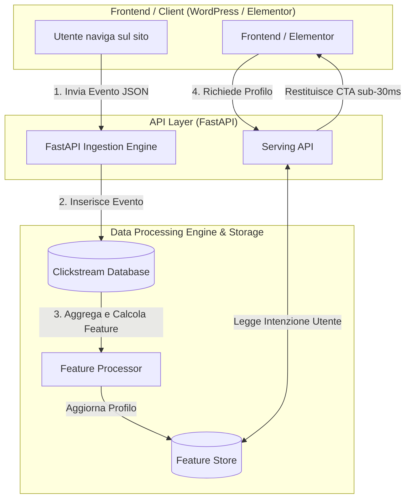

# ⚡ Morph AI Engine

> **Proof of Concept: Real-Time Web Clickstream Pipeline, Data Warehouse & Feature Store for Dynamic Web Personalization.**

[](https://www.python.org/)
[](https://fastapi.tiangolo.com/)
[](https://www.sqlite.org/)
[](https://www.postgresql.org/)
[](https://www.getdbt.com/)

---

## 🇮🇹 Presentazione del Progetto (Complementors)

Questo repository è un **Proof of Concept (PoC)** ideato e sviluppato da **Davide Scolamiero**, fondatore di **Complementors** (partner digitale specializzato in Web Design, SEO/GEO avanzata, Data Engineering e AI applicata al business).

### Obiettivo del Progetto
Dimostrare l'architettura tecnica e la fattibilità di un **sito web adattivo**: un ecosistema che non mostra la stessa identica esperienza a tutti gli utenti, ma decide quali contenuti, layout e Call-To-Action (CTA) mostrare in tempo reale basandosi sul contesto, la geolocalizzazione e il comportamento di navigazione.

L'obiettivo non è vendere la tecnologia in sé, ma **massimizzare il tasso di conversione (CRO) e le prenotazioni** dei clienti trasformando i dati di traffico anonimo in profili di intenzione d'acquisto.

---

## 🎯 Overview & Architecture

**Morph AI Engine** ingesta eventi clickstream ad alta frequenza, trasforma i log grezzi di navigazione in feature comportamentali e restituisce profili contestuali a bassa latenza per la personalizzazione dinamica del frontend.

### Il Flusso Dati (Data Pipeline)
1. **Event Tracking:** Il browser o il CMS (es. WordPress, Next.js) invia in modo asincrono un payload JSON con ogni interazione dell'utente (scroll, dwell time, pagina vista, contesto geo).
2. **Ingestion Layer:** API ad alte prestazioni in **FastAPI** che valida lo schema dell'evento.
3. **Feature Engineering:** Calcolo dinamico degli score di intenzione (es. tempo speso su menu vs carta dei vini).
4. **Feature Store:** Memorizzazione del profilo utente aggiornato per l'accesso immediato.
5. **Serving Layer:** Endpoint dedicato interrogato dal frontend per scambiare CTA o sezioni di pagina prima del rendering.



---

## 🛠️ Stack Tecnologico

* **Backend Framework:** FastAPI (Python 3.11+)
* **Validation & Data Contracts:** Pydantic v2
* **Storage (MVP):** SQLite (zero-config per ambiente locale e test)
* **Storage (Production Architecture):** PostgreSQL / Redis / Supabase
* **Data Transformation (Batch Layer):** dbt-core (Star Schema Data Warehouse)

---

## 📐 Schema Dati & Profilazione

### 1. Ingestion Event Schema
```json
{
  "event_id": "9b1deb4d-3b7d-4bad-9bdd-2b0d7b3dcb6d",
  "user_id": "usr_roma_01",
  "session_id": "sess_889123",
  "page_category": "carta_vini",
  "dwell_time_seconds": 45.0,
  "city": "Roma",
  "device": "mobile"
}
```

### 2. Output Profile Response
```json
{
  "user_id": "usr_roma_01",
  "is_known": true,
  "total_events": 5,
  "is_returning_visitor": true,
  "last_city": "Roma",
  "primary_interest": "carta_vini",
  "recommended_cta": "degustazione_vini_venerdi"
}
```

---

## 🚀 Quickstart (Esecuzione Locale)

### 1. Clona il repository e installa le dipendenze
```bash
git clone [https://github.com/Daddo172/morph-ai-engine.git](https://github.com/Daddo172/morph-ai-engine.git)
cd morph-ai-engine
pip install -r requirements.txt
```

### 2. Avvia l'Engine FastAPI
```bash
uvicorn main:app --reload
```
L'API sarà attiva su `http://127.0.0.1:8000`. Puoi accedere alla documentazione Swagger automatica all'indirizzo `http://127.0.0.1:8000/docs`.

### 3. Genera Traffico di Prova
In un secondo terminale, esegui lo script di simulazione traffico:
```bash
python generate_traffic.py
```

### 4. Interroga il Profilo Calcolato
```bash
curl -X GET "[http://127.0.0.1:8000/api/v1/profile/usr_roma_01](http://127.0.0.1:8000/api/v1/profile/usr_roma_01)"
```

---
